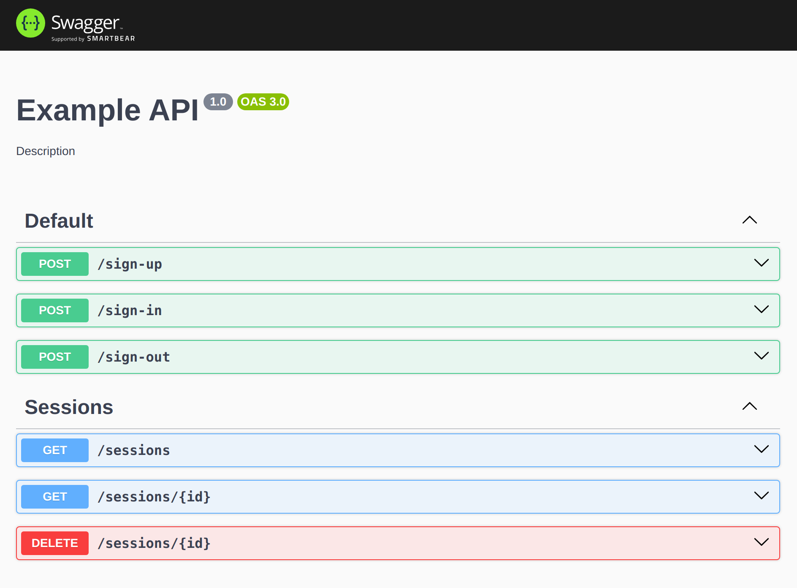

## Example Auth Sessions (mongo + redis)

[](https://github.com/mat-twg/example-auth-sessions/actions/workflows/master.yaml?result=latest)

> Разработайте сервис авторизации на основе сессий
> Сервис должен хранить учетные данные пользователей, позволять регистрировать их, выдавать им доступ и проверять его
> действительность.
>
>Сессия должна содержать информацию об устройстве с которого был произведен вход. У авторизованного пользователя должна
> быть возможность посмотреть список своих сессий и завершить любую из них
>
>Требования
>
>- Используйте NestJs и Typescript для создания приложения
>- Выберете базу или базы данных для приложения, объясните свой выбор на презентации
>- Напишите тесты для методов API
>- Составьте документацию API, опишите все доступные эндпоинты и параметры запросов

### Requirements

`docker docker-compose make node19 yarn`

### Configure

Copy `.env` to `.env.local` to override any vars, for e2e tests `.env.e2e` file will be used if exists

### Launch

```shell 
# up redis and mongodb container or via docker-compose cli
make up
```

```shell
# http://localhost:3000/doc 
yarn start
```

Swagger available at `/doc` and specs at `/doc-json` `/doc-yaml`



### Tests

```shell
# e2e tests, configure .env.e2e file to define db and settings
yarn test:e2e
```
